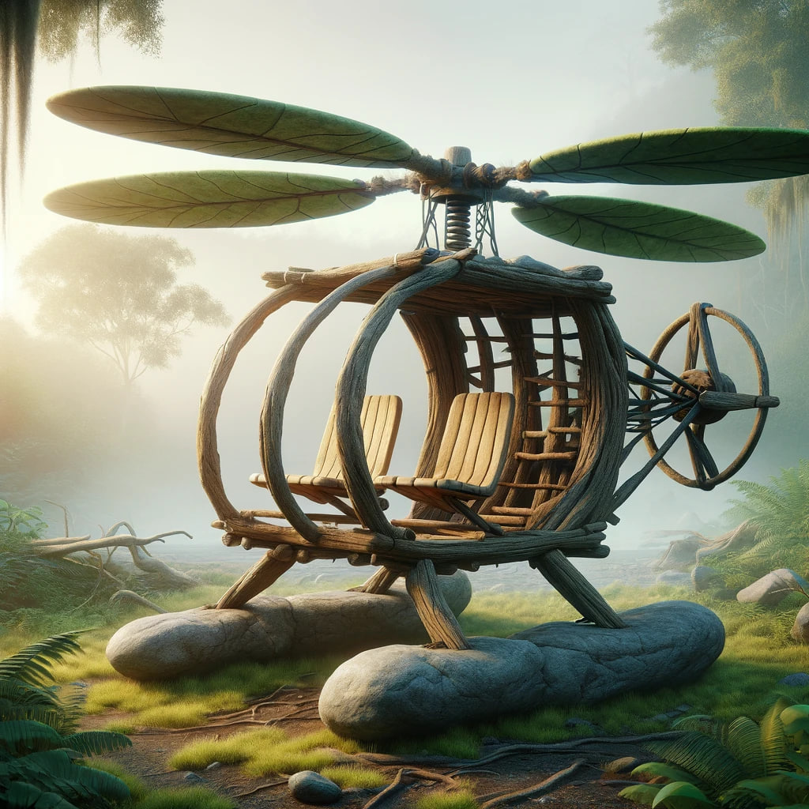
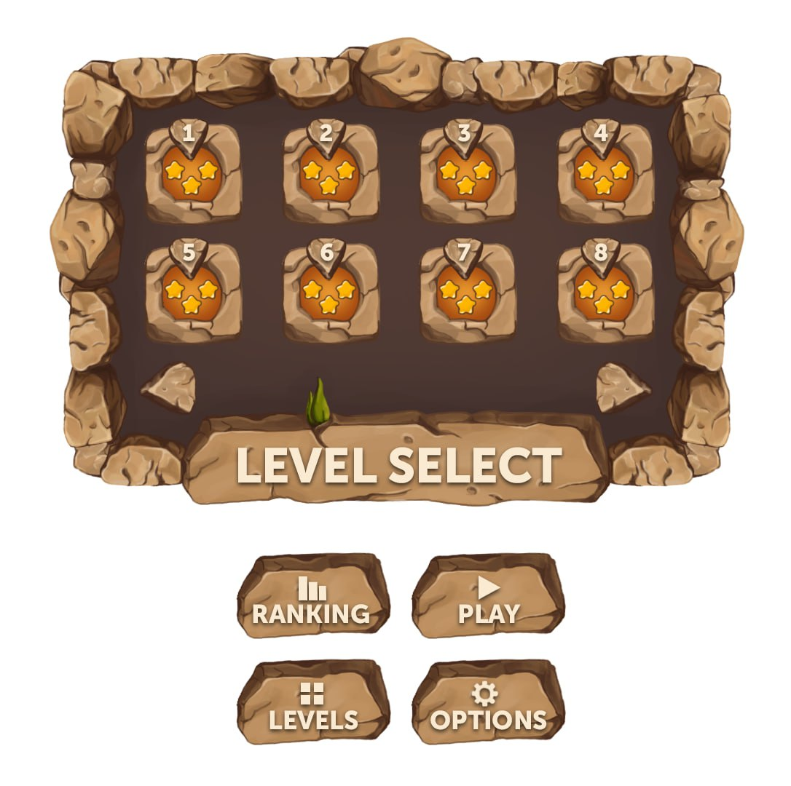

# Helicopter Taxi GDD

Вертолёт летает с платформы на платформу и перевозит пассажиров. Пассажиры (NPC) появляются у входов в пещеры (точках спавна) и просят перевезти их в другую пещеру.

Игровой движок: Unity 6.1
Используемый рендеринг: Universal Render Pipeline
Графика: 2D

  

## Управление вертолётом

Используя стрелки (вверх, вниз, вправо, влево) или on-screen gamepad на android, вы можете перемещать вертолёт по экрану.

Чтобы поднять вертолёт, нажмите вверх - чем дольше вы держите клавишу, тем быстрее будет подниматься вертолёт.

Когда вы отпускаете клавишу вверх, вертолёт автоматически начнёт падать, ускоряясь в падении. Чтобы увеличить скорость падения вертолёта, нажмите вниз. Вы можете перемещать вертолёт влево или вправо, нажимая соответствующие клавиши.

**User Case**

1. Логика такая, когда я жму кнопку вверх, то скорость плавно увеличивается согласно параметру "ускорение" и доходит до некоего максимума, который также задан переменной.

2. По сути изначально, когда я жму "вверх" из-за гравитации он всё равно падает вниз, постепенно падение замедляется и когда скорость превышает гравитацию, начинает подниматься вверх, разгоняясь до лимита скорости.

3. При нажатии вправо и влево должна добавляться скорость вправо и влево и так же упереться в лимит скорости.

4. При этом если я разогнался вправо и отпустил клавишу, то разгон сохраняется и куб продолжает лететь с этой скоростью, пока я не нажму влево, чтобы уменьшить или обратить скорость.

5. Скорость вправо и влево должна обнуляться при приземлении.

## Вода

На каждом уровне есть блок воды. При попадании в воду, вертолёт "выталкивает" на поверхность. Чем выше скорость попадания в воду, тем выше обратная скорость, с которой его вытолкнет.

Также возможно заставить вертолёт “нырять” - чем выше скорость падения, тем глубже в воду он сможет погрузиться.

Я это вижу так. Есть блок воды - это по сути куб на который материал наложен с шейдером воды. У куба нет коллайдера, то есть через него можно свободно проходить, но при этом в нём действует отрицательная гравитация, и чем сильнее в него залететь, тем сильнее вытолкнет.

## Система здоровья

У игрока полоска здоровья (100%), столкновение снимает от 0 до 50% жизней в зависимости от скорости движения.

После того как здоровье опустилось до 0 - поставить игру на паузу, вызвать экран на котором 3 варианта:

- Отремонтировать вертолёт на 20% за просмотр рекламы
- Перезапустить уровень
- Выйти на карту уровней

## Система пещер

На уровне есть пещеры. Пещера - gameobject со спрайтом. Из случайной (задаётся в GameManager) пещеры выходит (спавнится) пассажир. Спустя N секунд (задаётся в GameManager - объект на сцене с аналогичным скриптом) выходит второй. Одновременно на сцене не может быть больше двух пассажиров.

## NPC - пассажиры

Состояния пассажира:

1. Анимация выхода из пещеры (~1 секунда)

2. Движение в сторону точки ожидания вертолета (exit point)

3. Ожидание (idle)

4. Движение в сторону вертолета

Во время состояний 2 и 3 пассажир может быть сбит вертолетом в воду с платформы.

Сначала пассажир выходит из пещеры (1). Идет к exit point, который является дочерним объектом у объекта пещера.

После того, как пассажир доходит до exit point он останавливается и ждёт. У пассажира есть радиус при котором он может сесть в вертолёт к игроку, при этом этот радиус работает только как raycast вправо и влево. При попадании вертолёта в этот радиус, пассажир двигается к нему, но при условии, что вертикальное движение вертолёта равно 0, вертолёт на платформе.

Приземлившись рядом с жителем пещеры, фигурка сообщит вам в облачке речи, куда она хочет попасть, и затем заберётся в вертолёт.

Для NPC необходим переключатель состояний через switch case (реализация полноценной машины состояний в данном проекте скорее всего без надобности):

1. Выход из пещеры (анимация на месте)  
2. Движение в сторону точки ожидания  
3. Ожидание  
4. Сообщение о нужном этаже в облачке  
5. Движение в сторону вертолёта

Получается механика, что если вертолёт в зоне досягаемости и NPC в состоянии ожидания, то он переходит в состояние “Движение в сторону вертолёта”. Если при вертолёт начал двигаться, то переходим в состояние “Движение в сторону точки ожидания”.

Теперь вы летите к месту назначения, где фигурка автоматически выйдет из вертолёта. Если вы доставите жителя пещеры в его пункт назначения особенно быстро, он наградит вас бонусным символом (очками).

Если вы столкнетесь с одним из жителей пещер при посадке, он упадёт с платформы в воду. Вы можете спасти фигурки, упавшие в воду, приземлившись на воду, после чего фигурка поплывёт к вертолёту.

Единственное исключение - старик, которого нельзя спасти, поскольку из-за его плохого физического состояния он тонет через короткое время.

На борт вертолёта за один раз можно загрузить только один объект или фигурку. Место назначения каждого жителя пещеры, который загружен на борт вертолёта, будет отображаться в строке состояния.

Необходимы переменные для GD:

1. Частота выхода каждого персонажа

2. Скорость каждого типа NPC на платформе

3. Скорость каждого типа NPC вплавь

4. Время “жизни” каждого типа NPC в воде

Вопросы:

Продумать логику выхода человечков, чтобы рандом выглядел интересным. Если вышел с платформы, то может ли новый снова появиться на той же или там есть КД, или очередь.

## Дерево и камень

Чтобы успешно выполнить эту задачу, вам нужно собрать энергию. Бросьте камень, который вы ранее собрали, в дерево и подберите появившийся фруктовый символ. (Камень собирается при посадке на него). Вы можете выбросить камень из вертолёта, используя кнопку огня.

Фрукты: яблоко / лимон / апельсин / банан / вишня / груша / клубника

Следует избегать встречи с враждебными животными или оглушать их камнем.

Эта логика под вопросом

## Строка состояния

Во время игры в нижней части экрана будет отображаться так называемая строка состояния. Она предоставляет информацию, необходимую для игры, такую как доступная энергия, счёт, заказы на транспортировку и т.д.

Слева направо отображается следующая информация:

- Количество жизней: показывает количество жизней (вертолётов), которыми обладает игрок/игроки. Игроки начинают с 3 жизней.

- Полоса энергии: в начале каждого уровня полоса энергии заполняет всю шкалу энергии.

- Мешок с деньгами: справа от мешка с деньгами указывается количество набранных очков.

- Список миссий: показывает количество выполненных миссий.

- Облачко речи: рядом с облачком речи показана фигурка внутри вертолёта или камень. Само облачко речи показывает место назначения, куда вам нужно лететь.

- Счётчик бонусов: как только фигурка садится в вертолёт, счётчик бонусов показывает счёт. Чем быстрее фигурка доставлена в пункт назначения, тем больше очков будет начислено игроку/игрокам.

- Множитель бонусов: показывает коэффициент, на который умножается счётчик бонусов, в зависимости от размера транспортной миссии.

## Опция для двух игроков  - рекомендую отказаться

Если вы выберете опцию для двух игроков в меню опций [F4], вы сможете играть одновременно с вторым игроком в командном режиме. Это означает, что оба игрока, каждый из которых управляет своим вертолётом, должны вместе выполнять задачи (собирать фигурки, бороться с врагами и т.д.). Игроки могут делиться "работой", так что один игрок может собирать энергию, в то время как другой выполняет транспортную работу. Если вертолёт уничтожен или энергия иссякнет, уровень заканчивается и начинается заново сначала. Если уровень прерывается 3 раза, игра проиграна (это также относится к режиму для одного игрока).

Пока под вопросом

## Противники

Игра, в которой единственной целью была бы транспортировка людей с одной платформы на другую, быстро бы надоела; таким образом, в игре есть ряд противников, которые пытаются усложнить вам жизнь.

Трицератопс: Пока вы не потревожите его на его платформе, он безобиден. Но если вы приземлитесь на его платформу, он посчитает вас захватчиком и нападёт на вас своим рогом. Если выхода нет, вы можете на несколько секунд вывести его из строя камнем.

Динозавр: Он спокойно спит на своей платформе, и вы можете подумать, что он не способен навредить, однако его громкое храпение постоянно угрожает сбить ваш вертолёт с курса.

Птеродактиль: Он самый опасный из всех противников. Если вы коснётесь его, ваш вертолёт немедленно разобьётся. Прямо перед появлением птеродактиля вы услышите крик. Как только вы услышите этот необычный звук, будьте готовы к манёвру.

## Меню опций

## Управление

Управление происходит с помощью мобильного джойстика

Протестировать управление с мобильного можно тут:  
[Unity Web Player | Voothor2](https://metawarlock.github.io/VoothorPrototype/)

