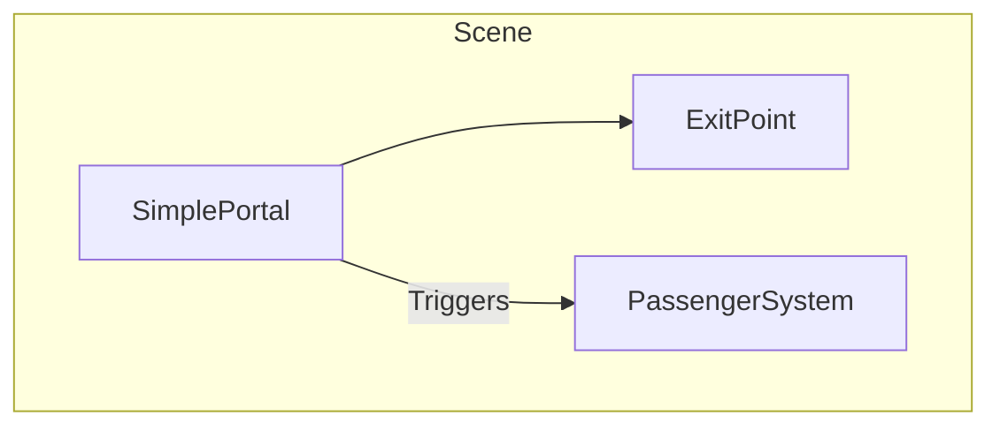

# Система порталов

Основной файл по всем остальным механикам игры: `game_systems.md`

Система пассажиров выделена в отдельную независимую систему. См. `Assets/02 Scripts/Passengers/passenger_docs.md`

## 1. Общие принципы

- **Простота:** Порталы - это простые объекты с минимальной логикой
- **Тестирование:** Предназначены для тестирования системы пассажиров
- **Взаимодействие через коллайдеры:** Порталы взаимодействуют с пассажирами только через триггеры

---

## 2. Упрощенная архитектура порталов

- **SimplePortal:** Простой компонент портала с номером и точкой выхода
- **ExitPoint:** Дочерний объект - точка ожидания вертолета

---

## 3. Компонент: SimplePortal

Простой компонент портала для тестирования системы пассажиров.

#### **Настраиваемые поля (в инспекторе):**
- `portalNumber` (int): Номер портала.
- `destinationPortal` (int): Номер портала назначения.
- `exitPoint` (Transform): Точка ожидания вертолета.

#### **Логика работы:**
- **Взаимодействие:** При входе пассажира в триггер передает ему информацию о назначении.
- **Прием:** Когда вертолет доставляет пассажира к этому порталу, портал открывает дверь, принимает пассажира и сообщает `PortalManager` об успешной доставке.
- **Выбор назначения:** При спавне, если `destinationType` = `Random`, портал запрашивает у `PortalManager` случайный доступный номер этажа (не равный текущему). В противном случае использует `specificDestination`.

---

## 4. Компонент: Passenger

Управляет поведением, состоянием и анимациями одного пассажира.

#### **Настраиваемые поля (в инспекторе):**
- `passengerType` (Enum: `Man`, `Woman`, `Elderly`): Тип пассажира.
- `settings` (PassengerSettings): Ссылка на ScriptableObject с настройками для данного типа.

#### **Состояния (State Machine):**
- `Spawning`: Появляется за дверью портала.
- `MovingToWaitPoint`: Идет к `exitPoint`.
- `Waiting`: Стоит на `exitPoint` и ждет вертолет (бесконечно). Над головой появляется UI с номером этажа назначения.
- `MovingToHelicopter`: Идет к приземлившемуся вертолету.
- `Boarding`: Исчезает (считается севшим в вертолет).
- `ReturningToWaitPoint`: Возвращается на `exitPoint`, если вертолет взлетел во время посадки.
- `EmergeFromHelicopter`: Появляется из вертолета на целевом портале.
- `MovingToPortalDoor`: Идет к двери целевого портала.
- `InWater`: Упал в воду, барахтается на поверхности, запущен таймер утопления.
- `SwimmingToHelicopter`: Плывет к вертолету, севшему на воду.
- `Drowned`: Утонул (анимация, исчезновение).

#### **Логика работы:**
- **Движение:** Перемещается с помощью NavMeshAgent или простой логики движения.
- **Взаимодействие с вертолетом:** Обнаруживает вертолет в состоянии `Grounded` или `InWater` в радиусе посадки и начинает движение к нему.
- **UI:** Управляет видимостью собственного UI с номером этажа.

---

## 5. Игровой цикл (Gameplay Flow)

1. **Начало:** `PortalManager` проверяет, есть ли место для нового пассажира (меньше ли текущее количество ожидающих, чем лимит). Если да, он выбирает доступный портал и дает команду на спавн.
2. **Спавн первого пассажира:** `Portal` создает пассажира, который отправляется к `exitPoint` и переходит в состояние `Waiting`.
3. **Спавн второго пассажира:** Через заданную задержку (например, 5 секунд) `PortalManager` повторяет шаг 1, и появляется второй ожидающий пассажир.
4. **Ожидание:** Пассажиры ждут вертолет. Игрок может выбрать, кого забрать первым.
4. **Посадка:** Игрок сажает вертолет рядом с пассажиром. Пассажир идет к вертолету и переходит в состояние `Boarding` (исчезает). `UIManager` обновляет UI, показывая цель.
5. **Доставка:** Игрок летит к целевому порталу. При посадке рядом с правильным порталом, пассажир появляется (`EmergeFromHelicopter`) и идет к двери (`MovingToPortalDoor`).
6. **Завершение и пополнение:** Пассажир входит в дверь и исчезает. `PortalManager` увеличивает счетчик спасенных и через заданную задержку запускает цикл спавна нового пассажира, чтобы пополнить очередь ожидания (шаг 1).

---

## 6. Взаимодействие с водой

- **Падение:** Если вертолет в полете (`Flying` state) касается пассажира в состоянии `Waiting` или `MovingToHelicopter`, пассажир падает с платформы и переходит в состояние `InWater`.
- **Выживание:** В состоянии `InWater` запускается таймер выживания (зависит от `PassengerSettings`). Пассажир проигрывает анимацию барахтанья.
- **Спасение из воды:** Если вертолет садится на воду рядом, пассажир переходит в состояние `SwimmingToHelicopter` и плывет к нему для посадки.
- **Утопление:** Если таймер выживания истекает, пассажир тонет (`Drowned`) и исчезает. `PortalManager` считает его потерянным и запускает спавн нового.

---

## 7. Анимации

#### **Аниматор двери портала (`doorAnimator`):**
- `Open`: Анимация открытия двери.
- `Close`: Анимация закрытия двери.

#### **Аниматор пассажира:**
- `Idle`: Ожидание на `exitPoint`.
- `Walk`: Движение по платформе.
- `Swim_Idle`: Барахтанье в воде.
- `Swim_Move`: Плавание к вертолету.
- `Drown`: Анимация утопления.